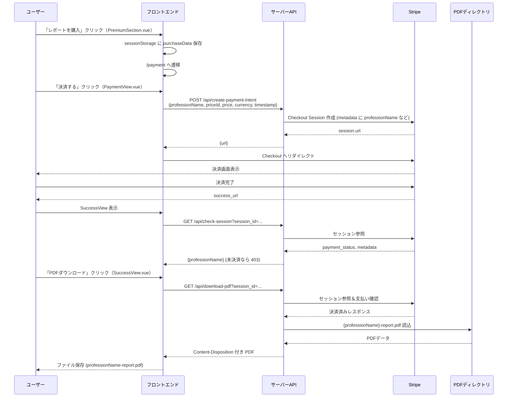

# 目的
ユーザーが職業レポートを購入し、決済完了後に PDF をダウンロードできるようにする。

# フロー概要
1. 診断結果画面（PremiumSection.vue）で「レポートを購入」押下し、選択職業の purchaseData（professionName, priceId, price, currency, timestamp）を sessionStorage に保存し `/payment` へ遷移。
2. 決済画面（PaymentView.vue）で「決済する」押下。POST `/api/create-payment-intent` に purchaseData を送信し、返却された [url](http://_vscodecontentref_/1) で Stripe Checkout へリダイレクト。
3. Stripe 決済完了後、[/success?session_id=...](http://_vscodecontentref_/2) へ戻る。
4. [SuccessView.vue](http://_vscodecontentref_/3) で GET [/api/check-session?session_id=...](http://_vscodecontentref_/4) を呼び、支払い済みを確認（未決済なら 403）。
5. ユーザーが「PDFダウンロード」を押下すると、GET [/api/download-pdf?session_id=...](http://_vscodecontentref_/5) を呼び、職業名に対応する `public/pdfs/{professionName}-report.pdf` をダウンロード。

# シーケンス図
