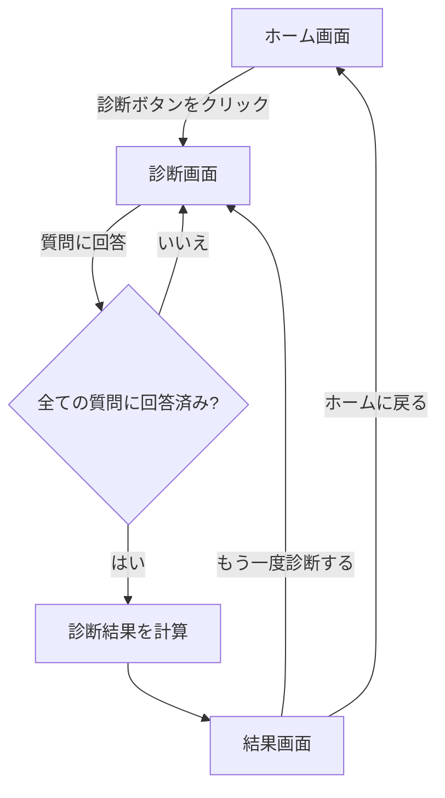
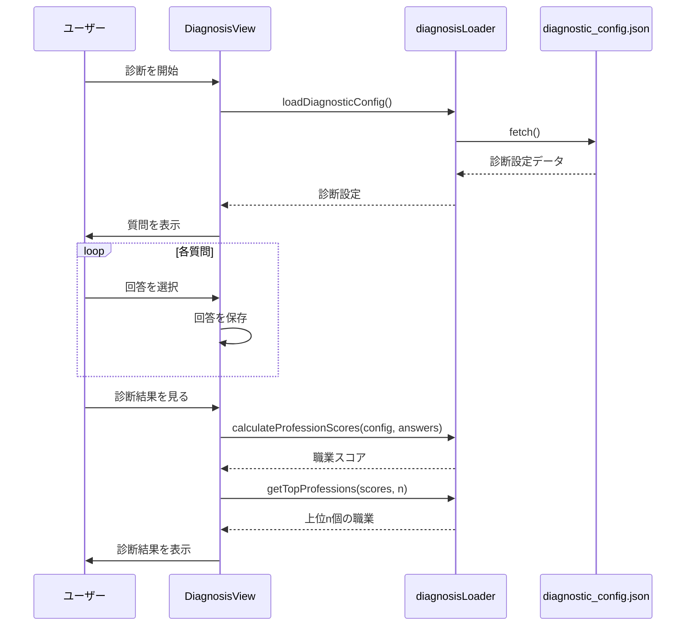
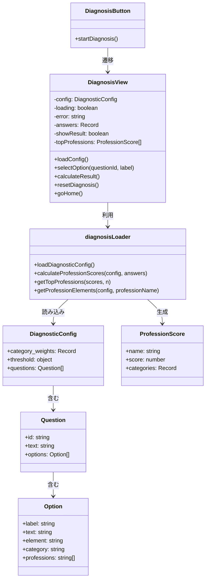
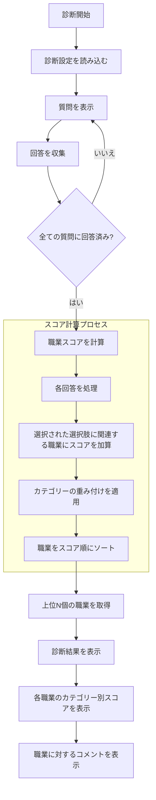

# フロントエンド診断システムの可視化

このドキュメントでは、mermaid.jsを使用してフロントエンドの診断システムの仕組みを可視化します。

## 1. ユーザーフロー



## 2. データフロー



## 3. コンポーネント構造



## 4. 診断ロジックのフロー



## 5. データモデル

```mermaid
erDiagram
    DiagnosticConfig ||--o{ Question : contains
    Question ||--o{ Option : contains
    Option ||--o{ Profession : references
    
    DiagnosticConfig {
        object category_weights
        object threshold
        array questions
    }
    
    Question {
        string id
        string text
        array options
    }
    
    Option {
        string label
        string text
        string element
        string category
        array professions
    }
    
    Profession {
        string name
    }
    
    ProfessionScore {
        string name
        number score
        object categories
    }